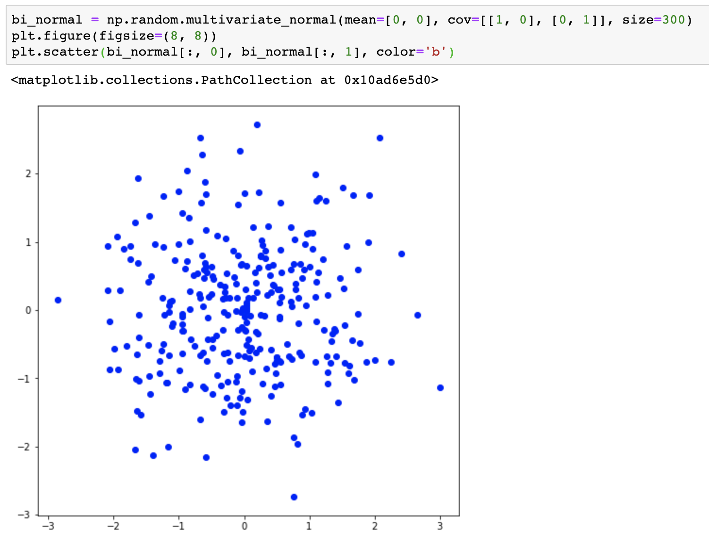
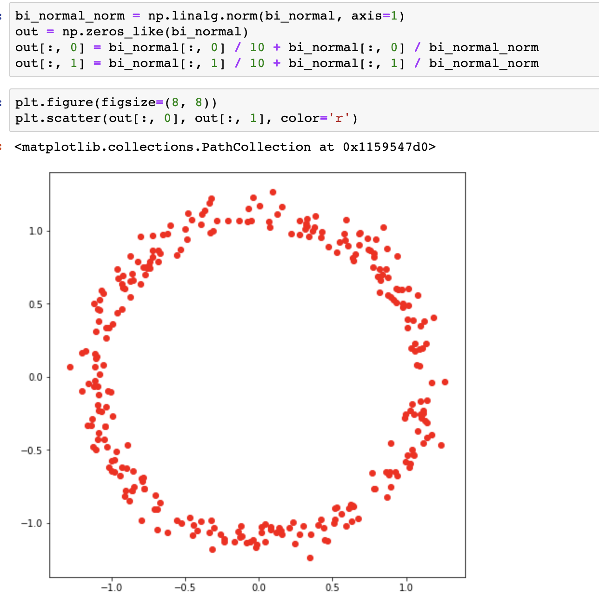

Intro to GANs
===

A GAN takes a random sample from a high dimensional distribution as input and maps it to the data space. The task of learning is to learn a high capacity deterministic function that can efficiently capture the dependencies and patterns in the data so that the mapped point resembles a sample generated from the data distribution. 

Example:

In the below example, I have generated 300 samples from Isotropic bivariate guassian distribution. 

When passed through a function , the points form a ring, which demonstrates that if we have a high capacity function, we can learn patterns in high dimensional data like images.

