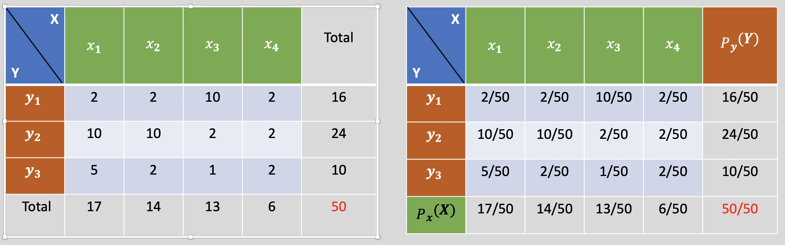
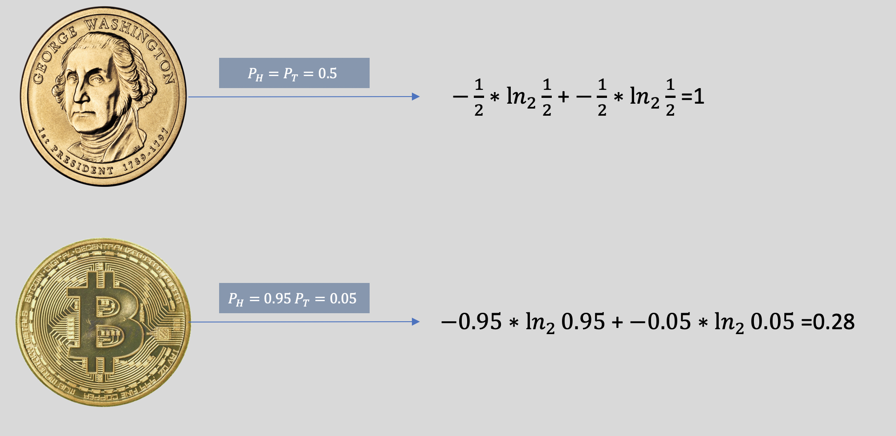
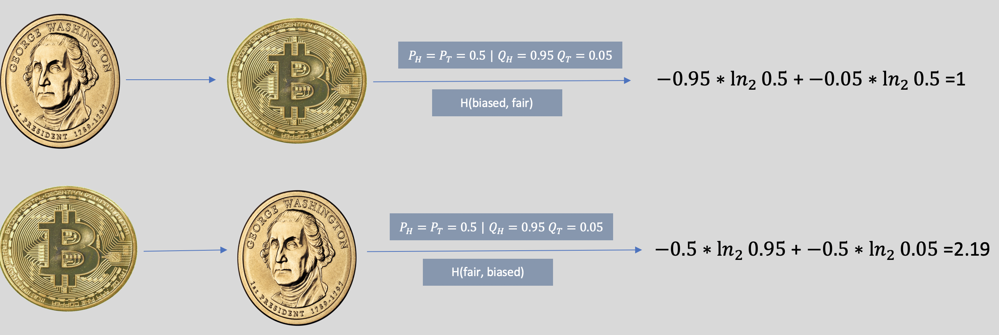

Intro to GANs
===

A GAN takes a random sample from a high dimensional distribution as input and maps it to the data space. The task of learning is to learn a high capacity deterministic function that can efficiently capture the dependencies and patterns in the data so that the mapped point resembles a sample generated from the data distribution. 

Example:
---

I have generated 300 samples from `Isotropic Bivariate Gaussian distribution`. 

When passed through a function , the points form a `ring`, which demonstrates that if we have a high capacity function, we can learn patterns in high dimensional data like images.

Probability Review
---

*frequency table and joint distribution of two discrete random variables*

<h3>Conditional Distribution</h3> 

In the above table, fix the value of a random variable, say `x = x_1`; the distribution of `y` when `x = x_1` is called conditional distribution, . Conditional expectation is expectation of the conditional distribution. 

In the above table, the conditional probability of `y_1` given `X=x_1` is `2/17`

<h3>Marginal Distribution</h3>

Integrate or summate over a variable, to get the marginal distribution of another variable. 

In the above table, the marginal probability of `x_1` according to above formula is `2/50 + 10/50 + 5/50 = 17/50`. 

<h3> Joint Distribution </h3>

A join distribution a.k.a data distribution captures the joint probabilities between random variables. In the above table, the join probability of `P(X = x_2 & Y = y_3)` is `2/50`. This is what a GAN tries to model from the sample data. 

Consider images of size `28 x 28`. Each pixel is a random variable that can take any value from 0 to 255. Hence, we have 784 random variables in total. GAN tries to model the dependencies between the pixels. 

<h3> Bayes Theorm </h3>

From the above table: `P(Y = y_1 | X = x_1) = P(Y = y_1 & X = x_1) / P(X = x_1)` = `(2/50)/(17/50)` = `2/17`

<h3> Entropy </h3>

Entropy measures the degree of uncertainity of an outcome of a trail according to a `p(x)`. 

 
The entropy of a unbiased coin is higher than biased coin. The difference in entropy increases with degree of ploraization of probabilites of biased coin.

<h3>Cross Entropy</h3>

Cross entropy measure degree of uncertainity of a trial according to `p(y)` but in truth according to `p(x)`.

Cross entropy is higher when a trial is conducted according to unbiased coin probability distribution but you think it is being conducted according to biased coin probability distribution. 

